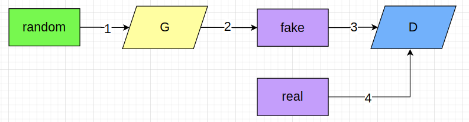
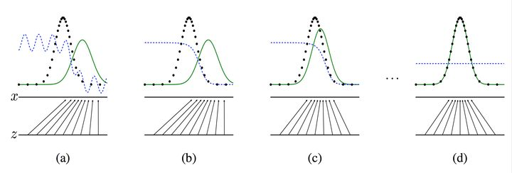
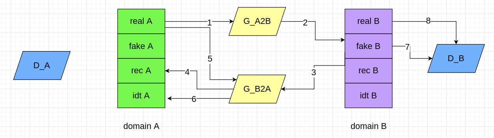
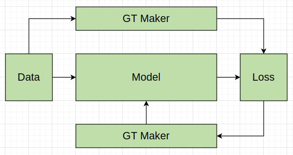

# 1. GAN
GAN的目的是，在根据给定的数据集情况下，训练出一个生成网络，能后模仿出给定数据集的特征和分布。
### 1.1 网络结构与数据流

图中共有5个元素：
- random：维度是(bs, 100， 1)的一个随机数, bs是batch_size缩写，下同；
- G: Generator 生成器（可以是一个最简单的全连接网络），生成数维度是(bs, 728, 1);
- fake: 也即G的生成结果，维度是(bs, 728, 1)， 代表bs个28*28的灰度图，是一个模仿的手写数字体结果；
- real： 真实的结果，维度是(bs, 728, 1)，代码中是真实的手写数字体数据集；
- D: Discriminator，判别器，用以判断数据数据是真假

运行数据流是：
- step 1: 固定D, 然后1->2->3 并将fake判别为真，这样用以训练G网络使得其生成结果尽量逼真
- step 2: 固定G, 然后执行3判别为假 执行4判别为真，以训练D的判别能力；

GAN的整个流程是在生成器G和判别器D的相互博弈中进行，step2能使D分辨能力越来越强，step1能使G模仿能力越来越强，最终达到D分辨不出fake和real

在这篇文章有图解释比较形象https://zhuanlan.zhihu.com/p/33752313

### 1.2 Loss计算
以上两个step对应2个loss，分别是:
- setp 1 对应的生成器loss_g 
- setp 2 对应的判别器loss_d

# 2. Gycle GAN
### 2.1 网络结构与数据流

图中共有12个元素，分为4大类，分别是：
- Domain A: 数据A类，比如马数据集；real A是正常采集的马的数据集
- Domain B: 数据B类，比如斑马数据集；real B是正常采集的斑马的数据集
- 生成器：G_A2B 从A转换成B的生成器；G_B2A 从B转换成A的生成器
- 判别器：D_A A类数据判别器；D_B B类数据判别器；

图中仅画出从A到B转换的Cycle GAN流程图，从B到A也相同没有画出而已。

运行数据流是：
- step 1: 固定D_B, 执行1->2->7，使得D_B判决为真，这里等同上GAN中的step 1，这里包含了loss_g_1
- step 2: 在step 1 生成 fake B基础上，执行3->4,对比real A和rec A使得其差异最小(loss_g_2)，这样就能使得fakeB不是随意生成而是包含real A的信息, 也是Cycle的由来
- step 3: 执行5->6 保证G_B2A通过real A时生成的idt A，能与real A差异最小(loss_g_3)
- step 4: 固定G_A2B和G_B2A, 执行7和8等同上GAN的step2，这里包含了loss_d
### 2.2 Loss计算

loss = loss_g_1 + loss_g_2 + loss_g_3 + loss_d
图中仅画出从A到B转换的Cycle GAN流程图，从B到A也相同没有画出而已。
所以从B到A也有类似于上面的4个loss， 一共是8个loss

# 4.思考
模型对应网络框架，是网络的“硬件基础”，体现了功能上限；
Loss决定了模型进化方向，需要根据功能需求来设计；

有个不成熟的机器学习结构在脑海中,

# 5. 参考：
课程视频：https://www.bilibili.com/video/BV19U4y1o77u
相关仓库：https://github.com/junyanz/pytorch-CycleGAN-and-pix2pix